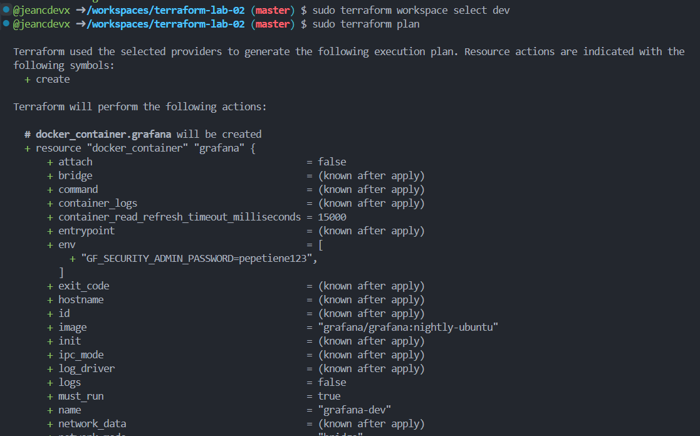

# Ambiente de Desarrollo (DEV) - Terraform Lab

efectivamente prof, me gano con este ejercicio y la maquina funcionando no ayudaba y tampoco lo complete a tiempo, pero no queria quedarme con la espinita de no resolverlo como se debia 🤗

## Descripción

Este proyecto utiliza Terraform para desplegar un ambiente de desarrollo containerizado usando Docker, con múltiples servicios organizados en diferentes redes.

## Arquitectura del Ambiente DEV

### Servicios Desplegados

- **Nginx (nginx-dev)**:
- **Redis (redis-dev)**:
- **PostgreSQL (postgres-dev)**:
- **Grafana (grafana-dev)**:

### Redes Docker

- **app_net_dev**:
- **persistence_net_dev**:
- **monitor_net_dev**:

### IPs de los Contenedores (Internas)

- Nginx: 172.18.0.2
- Redis: 172.19.0.3
- PostgreSQL: 172.19.0.2
- Grafana: 172.20.0.2

## Configuración de Base de Datos

- **Host**: postgres-dev
- **Base de Datos**: devdb
- **Usuario**: devuser
- **Contraseña**: devpassword
- **Puerto**: 5432

## Configuración de Grafana

- **Usuario Admin**: admin
- **Contraseña**: admin123
- **Puerto**: 3000

## Comandos para la ejecucion

```bash
sudo terraform init

sudo terraform workspace list
sudo terraform workspace new dev
sudo terraform workspace select dev

sudo terraform plan
sudo terraform apply
```

## Comandos para comprobar funcionamiento

```bash
# Verificar estado de los contenedores
docker ps

# Verificar redes Docker
docker network ls

# Ver logs de Nginx
docker logs nginx-dev
```

## Imagenes de resultados





